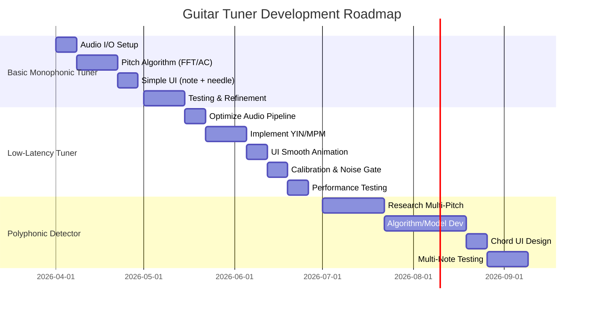

# Pitch Detection for Guitar Apps: Executive Summary  

For guitar-tuning apps, **monophonic** pitch detection (one string/note at a time) is relatively straightforward and can be built with well-known time- or frequency-domain algorithms. Many open-source libraries (e.g. Aubio【7†L19-L27】, TarsosDSP【56†L7-L10】) support monophonic tuning. **Polyphonic** detection (chords) is much harder, often requiring specialized multi-pitch or machine-learning approaches and heavy computation. Real-time **latency** is critical: musicians expect feedback in **≤10 ms**【15†L684-L687】, though platforms often guarantee around 20 ms. On mobile, iOS offers low-latency Core Audio/AVAudioEngine, while Android’s Pro Audio profile targets ≤20 ms round-trip【17†L503-L510】. Audio input can use the device microphone or external interfaces (USB, line-in). Key trade-offs include CPU vs. accuracy: FFT-based methods (fast, polyphonic-capable) can be noisy or coarse, while autocorrelation/YIN (slower) give stable monophonic pitch. Libraries and SDKs range from free open-source (Aubio, TarsosDSP, Essentia) to commercial (Superpowered). Cross-platform frameworks (React Native, Flutter) ease development but add overhead. Testing uses standard metrics like cents-error or **Raw Pitch Accuracy (±50 cents)**. Finally, UI/UX should display note names and detuning (needle, strobe, or bar), allow calibration (e.g. A4=440 Hz, alternate temperaments), and handle noisy/distorted guitar signals. Deployment must consider microphone permissions (Info.plist, Android manifest) and app store rules.  

## Platforms, Toolchains & Audio APIs  

- **iOS (Swift/Obj-C)** – Uses Core Audio or AVAudioEngine for real-time I/O. Highly optimized (AudioKit, an MIT-licensed Swift framework, offers built-in pitch trackers). Typical buffer latencies are a few ms. Apple devices provide consistent low-latency audio if using hardware‐optimized APIs. (Pro: strict ecosystem, pro audio support; Con: Apple-only, learning curve).  
- **Android (Kotlin/Java with NDK/C++)** – AudioRecord (Java) or Oboe/AAudio (native C++) are common. Android’s “Pro Audio” devices target <20 ms round-trip【17†L503-L510】, though many phones have higher latency. Oboe (Google’s C++ library) simplifies low-latency audio and automatically chooses AAudio or OpenSL ES. (Pro: broad device support; Con: OS/driver fragmentation, harder to guarantee latency).  
- **Cross-Platform (React Native, Flutter, Unity, Electron, Web)** –  
  - *React Native (JS)*: Develop once for iOS/Android. Use native modules/plugins for audio (e.g. [Tuneo](https://github.com/DonBraulio/tuneo) uses Swift/Kotlin bridges to C++ DSP)【33†L319-L327】. Adds overhead, but can achieve “near-native” speed with modern architecture (turbo modules). UI can be smooth (Skia/Reanimated). (Pro: shared codebase; Con: complexity of native bridges, less real-time control).  
  - *Flutter (Dart)*: Similar cross-platform approach. Audio plugins exist, but real-time processing still often relies on platform channels. Fewer examples in audio. (Pro: fast UI, single codebase; Con: maturity of audio support is less, potential latency).  
  - *Unity (C#)*: Primarily for games; can use native plugins. Not a typical choice for tuner apps due to large footprint. (Pro: rapid development if already a Unity developer; Con: heavy, not optimized for audio apps).  
  - *Electron/Web (JS)*: Uses Web Audio API for capture and FFT. Good for desktop/browser demos. Latency is higher (tens of ms), and dependencies large. (Pro: cross-desktop, rich UI; Con: heavy weight, not mobile-app friendly).  
- **Desktop (C++, JUCE, Qt, etc.)** – Native frameworks (JUCE, Qt) with platform audio (WASAPI, CoreAudio) allow high performance. Good for prototypes or pro audio tools. (Pro: extreme control, low latency; Con: complex C++ code, not mobile).  
- **Web Audio API (JavaScript)** – Allows in-browser tuner (e.g. [StroboPro](https://strobopro.se) online tuner). Limited by browser buffer and user permissions; not as precise or low-latency as native. (Pro: zero installation; Con: higher latency, depends on browser’s processing time).  

**Table: Platform Stacks** (example comparison)  
| Stack                | Language(s)            | Audio APIs / Frameworks        | Pros                                                   | Cons                                                 |  
|----------------------|-----------------------|-------------------------------|--------------------------------------------------------|------------------------------------------------------|  
| **iOS (native)**     | Swift/Obj-C           | Core Audio, AVAudioEngine     | Very low latency, mature DSP libraries (AudioKit), Metal UI, App Store access | Apple-only, App Store review, Obj-C interop needed    |  
| **Android (native)** | Kotlin/Java + C++     | AudioRecord, AAudio/Oboe      | Wide hardware support, Google Play access, AAudio for low latency | Android fragmentation, sometimes higher latency       |  
| **React Native**     | JavaScript            | AVFoundation/AudioRecord via native modules | Cross-platform code sharing, fast iteration           | Overhead of JS bridge, native module complexity       |  
| **Flutter**         | Dart                 | (Platform channels to native) | Cross-platform, beautiful UI, Google support           | Less mature audio plugins, added latency              |  
| **Electron (Desktop)** | JavaScript/Node     | Web Audio API, node-audio libs | Cross-OS, web tech (HTML/CSS UI)                     | Very heavy, not mobile, higher latency              |  
| **Unity**           | C#                    | Unity audio (or plugins)     | Fast prototyping for developers familiar with Unity     | Large app size, not specialized for audio accuracy    |  

*Citation:* On Android, real-time apps should aim for ~10 ms latency【15†L684-L687】; Pro Audio devices guarantee ~20 ms【17†L503-L510】. iOS CoreAudio/AVAudioEngine typically achieves sub-10 ms latency with proper setup.  

## Audio Input Methods  

- **Built-in Microphone** (phone/laptop mic) – Simplest, no extra hardware. Mics may color the tone or be noisy, especially on cheap devices.  
- **External Interface/Adapter** – E.g. USB audio interface, or Lightning/USB-C audio adapters. Provides cleaner signal and lower latency. (iOS requires “Audio Interface” accessory support or TRRS cable; Android supports USB audio class).  
- **Direct Line-In** – Some devices have 3.5mm TRRS line-in (rare now) or guitar interfaces (e.g. iRig). Reduces noise and gain staging issues.  
- **Digital (USB/Lightning)** – e.g. digital guitar interfaces. Offers best fidelity and lowest latency; requires proper drivers/hardware.  

Real-time tuner apps often allow selecting input. In iOS, set AVAudioSession to _PlayAndRecord_ to capture mic/line input; add **NSMicrophoneUsageDescription** to Info.plist. On Android, request `RECORD_AUDIO` and possibly USB permission. Always monitor signal level and mute feedback to avoid echoes.  

## Pitch Detection Algorithms  

No single algorithm is best for all cases【53†L130-L139】. Common methods include:  

- **Zero-Crossing** (time domain) – Very simple (count waveform zero crossings). Extremely fast (O(N)), but only works on near-sine signals. Fails on complex guitar tones or noise【53†L141-L150】. (Use: trivial toy or very fast check; Not recommended for accuracy.)  
- **Autocorrelation** (time domain) – Compares signal with delayed copies to find period. Good for strong monophonic signals. Fairly robust to inharmonicity (“perceived pitch”)【25†L165-L173】. Complexity ~O(N log N) with FFT acceleration. **Pros:** Works on noisy signals better than FFT peak; **Cons:** Octave (subharmonic) errors common, weak for chords/polyphony【53†L150-L159】. Many library implementations (e.g. aubio’s pitch *“yinfft”* or *“yin”*).  
- **YIN** (time domain) – An improved autocorrelation variant that refines fundamental estimation and reduces bias【53†L160-L164】. More accurate and less error-prone than naive autocorr, at cost of more computation. Widely used for monophonic pitch tracking (e.g. in Aubio, TarsosDSP).  
- **MPM (McLeod Pitch Method)** – Another autocorrelation-based method, optimized for speed/accuracy. Also handles inharmonic signals well. Included in TarsosDSP【56†L7-L10】.  
- **FFT-based (Frequency domain)** – Take FFT of input; find peak or apply methods like Harmonic Product Spectrum (HPS) or cepstrum. Can detect multiple fundamentals (polyphonic) if combined with heuristics. Fast (O(N log N)) and effective for well-tuned signals. **Pros:** Can detect chords (with multi-peaks) and works well when harmonics line up; **Cons:** Requires larger buffer for resolution (increases latency), susceptible to noise, and naive FFT peak tends to mis-pick strong overtones【25†L165-L173】【53†L170-L179】. Some implementations combine FFT with windowing and parabolic interpolation to improve accuracy.  
- **Cepstrum** – Take log-spectrum and inverse FFT (so-called cepstrum). Highlights periodicity of harmonics. Good at finding pitch even if waveform complex. Complexity ~O(N log N). Can detect fundamentals at low freq. Less used in simple apps, but included in Essentia.  
- **Hybrid / Spectral-Temporal (e.g. YAAPT)** – Combine time and frequency cues, dynamic programming to track pitch over time【53†L192-L200】. More accurate in difficult conditions but complex to implement.  
- **Machine Learning (Neural networks)** – Deep models (CNNs/RNNs/Transformers) trained on large datasets can detect pitch or transcribe multiple notes. E.g. Google’s SPICE or onsets-and-frames models perform frame-wise pitch classification. **Pros:** Can handle complex polyphonic textures; **Cons:** Heavy computation, requires training data, larger binary (though TFLite can run small models on device). Not common in simple tuner apps, but emerging (and can use **TensorFlow Lite** on mobile【51†L104-L113】).  

**Table: Pitch Detection Algorithms**

| Algorithm               | Domain       | Strengths                            | Weaknesses                                   | Complexity        | Use Cases       |
|-------------------------|--------------|--------------------------------------|----------------------------------------------|-------------------|-----------------|
| Zero-Crossing           | Time         | Very simple (O(N)), ultra-fast       | Only works on pure tones; fails on noise/multiple harmonics【53†L141-L150】 | O(N)             | Toy/demo only   |
| Autocorrelation (ACF)   | Time         | Robust on monophonic, captures “perceived” pitch【25†L165-L173】 | Subharmonic/octave confusion, not polyphonic【53†L150-L159】 | O(N log N) w/FFT | Basic tuner (guitar)  |
| YIN                     | Time         | High accuracy on monophonic signals【53†L160-L164】 | More computation than plain ACF            | O(N log N)        | Monophonic tuner |
| McLeod (MPM)            | Time         | Fast, accurate on inharmonic signals (guitar)【56†L7-L10】 | Similar limitations as ACF/YIN             | O(N log N)        | Monophonic tuner |
| FFT / HPS / Cepstrum    | Freq.        | Can detect polyphony (chords) by analyzing harmonics【53†L170-L179】 | Requires larger buffer (latency), noise-sensitive | O(N log N)      | Chord detection, single-note on rich signal |
| Spectral-Temporal (YAAPT)| Hybrid      | Combines time/freq for better accuracy | Complex to implement, heavier compute      | O(N log N) + DP   | Robust monophonic tracking |
| CNN / RNN ML            | Depends      | High polyphonic accuracy (with training) | Heavy inference cost (but optimized by TFLite), large model | High            | Polyphonic transcription |

*Key points:* Time-domain methods (ACF/YIN/MPM) excel at **monophonic** guitars with low CPU, giving ±1–2 cent accuracy for clean input. However, they often “drop an octave” if misled by strong overtones【53†L153-L159】. FFT-based methods can inspect multiple harmonics to confirm fundamentals, allowing chord or noisy signals analysis, at the cost of larger FFT sizes (thus ~20–50 ms latency).  

**Noise/Overdrive:** Distorted guitar tones introduce broadband noise and inharmonicity. Autocorrelation and YIN still track the fundamental fairly robustly (they latch onto “perceived” pitch)【25†L165-L173】, whereas FFT peaks can be smeared. In practice, smoothing (averaging over frames) and pre-filtering (band-pass around expected string frequencies) help stability.  

## Libraries and SDKs  

A variety of libraries and SDKs support pitch detection or audio processing. Below is a comparison of notable ones:

| Library / SDK       | Language / Platform   | Features                                 | License         |  
|---------------------|-----------------------|------------------------------------------|-----------------|  
| **Aubio**           | C (with Python bindings) – supports Linux, macOS, iOS, Android【7†L19-L27】 | Real-time audio analysis: onset, pitch (several methods), beat, MFCC, etc【54†L125-L132】. Optimized C code for speed (no heap alloc in processing)【54†L125-L132】. | GPL (free)【7†L19-L27】 (GPL-3+) |  
| **TarsosDSP**       | Java (Android, Desktop)【56†L7-L10】    | Real-time audio processing in Java. Includes pitch detectors (YIN, McLeod, Dynamic Wavelet)【56†L7-L10】, onset detection, time-stretch (WSOLA), resampling, filters. Easily integrated on Android. | GPL-3 (free)【56†L7-L10】 |  
| **Essentia**        | C++ (cross-platform)   | Extensive music analysis: pitch (e.g. `PitchYin`), onset, rhythm, MFCC, etc. Highly accurate; used in research. | AGPL (free) |  
| **Librosa**         | Python (SciPy stack)   | Off-line audio analysis (not real-time). Pitch detection via YIN, HPS, etc. Good for prototyping/tutoring. | ISC (permissive) |  
| **SoundTouch**      | C++                   | Real-time time-stretch and pitch-shift (change speed/pitch)【48†L102-L105】. Not a pitch *detector*. | LGPL-2.1 / commercial【48†L102-L105】 |  
| **AudioKit**        | Swift (iOS/macOS)     | High-level audio library. Includes a `PitchTap`/`PitchTracker` node (uses FFT & autocorr). Great for iOS apps (MIT license). | MIT (free) |  
| **Core Audio / AVAudio** | C/Objective-C (iOS/macOS) | Apple’s built-in audio frameworks. Very low-latency, professional quality. No separate license (Apple platform API).  | Proprietary (platform) |  
| **Android AudioRecord/AAudio/Oboe** | Java/C++ (Android) | Native audio recording APIs. AAudio (NDK) or Oboe library (C++) provide lowest-latency capture on modern devices.  | Apache 2 (Oboe) |  
| **Web Audio API**   | JavaScript (Browser)  | Audio capture and FFT in the browser. Supports real-time audio analysis (e.g. `AnalyserNode`). Latency typically 50+ ms. | N/A (browser feature) |  
| **TensorFlow Lite** | C++/Java/Kotlin (cross) | On-device ML inference. Can run trained pitch estimation models (e.g. CNN). Good for speech/instrument classification or polyphonic transcription. | Apache 2 (free) |  

*Sources:* Aubio offers “several pitch detection methods” in a real-time C library【54†L125-L132】【7†L19-L27】. TarsosDSP (Java) explicitly lists YIN and MPM pitch trackers【56†L7-L10】. The F-Droid “Tuner” app uses autocorrelation plus FFT with spectral phase refinement【58†L15-L24】. Licensing varies (GPL vs MIT vs Apache); be mindful of GPL’s copyleft if using in a commercial app.  

## Frameworks/Languages Compared  

- **Swift/Objective-C (iOS)** – Direct use of AVAudioEngine or Audio Units. AudioKit (Swift) simplifies DSP. Best for minimal latency and Apple UX, but iOS-only.  
- **Kotlin/Java (Android)** – Use AudioRecord or NDK. Can also integrate C++ DSP with JNI for performance. Supports the broadest hardware but requires handling variety of devices.  
- **React Native (JS)** – Use native modules (like TurboModules) to bridge to C++ pitch code【33†L319-L327】. Easier UI, cross-platform, but adds a JS layer. Example: [Tuneo](https://github.com/DonBraulio/tuneo) is a React Native guitar tuner using a C++ YIN module【33†L319-L327】.  
- **Flutter (Dart)** – Similar concept: use platform channels/plugins for audio I/O and DSP. Some “flutter_audio_capture” plugins exist, but expect more integration work.  
- **Unity (C#)** – Can call native plugins or use `OnAudioFilterRead` for audio data. Generally overkill unless the app is a game or uses 3D graphics.  
- **Electron (Node.js)** – Desktop apps can use WebAudio or Node modules. Audio latency on desktops can be low with WASAPI or JACK, but Electron itself adds overhead.  
- **Browser (JS/Web)** – Use MediaStream + Web Audio API. Demonstrations exist (e.g. “Autochords” online tuner). Latency is higher (microphone piped through browser), and requires user to grant mic access.  

*Pros vs. Cons:* Native code (Swift/Kotlin) yields the best performance and lowest latency but locks to one ecosystem. Cross-platform tools save development time, but bridging to native audio DSP is tricky and may incur additional latency. For example, Tuneo (React Native) achieved *“real-time pitch detection”* with smooth UI by combining Skia-rendered interface with native C++ DSP【33†L319-L327】, but it’s a complex setup.  

## Performance and Accuracy Trade-offs  

- **Buffer Size vs Latency:** Smaller audio buffers reduce latency but increase CPU overhead and risk of dropouts. Typical low-latency targets are 5–10 ms (buffer ~256 samples at 44.1 kHz).  
- **Algorithm Cost:** YIN/MPM yield high accuracy (<1 cent error) for single notes【35†L290-L298】, but are heavier than simple FFT for a given buffer. FFT-based (e.g. 2048-sample FFT) is faster due to optimized libraries, yet needs a larger buffer (46 ms at 44.1 kHz).  
- **Accuracy Expectations:** A well-tuned monophonic detector can hit <±1 cent error on guitar fundamentals (as GuitarTuner claims ~±0.5 cent around A4【35†L290-L298】). Accuracy degrades if signal is noisy/distorted. A spectral approach with parabolic interpolation can improve peak accuracy.  
- **CPU vs Battery:** On mobile, continuous DSP can drain battery. Using hardware DSP (if available), or optimizing in C++, is beneficial. Many libraries are written in C/C++ (aubio, Essentia) to maximize speed. Java/Kotlin (TarsosDSP) can still meet real-time on modern devices, but measure CPU use.  
- **Noise Handling:** Pre-filtering (bandpass around expected string frequencies) and smoothing filters (median of recent pitch estimates) can improve robustness. Some apps display a **confidence meter** or silence detection to reject unreliable readings.  
- **Overdrive/Distortion:** High gain guitar sounds have inharmonic overtones; time-domain methods like YIN focus on perceived pitch despite that. Frequency methods may pick a wrong overtone. In practice, monophonic tuners often work reasonably well even on distortions, but rapid strums can confuse detectors (see wiki “octave error” discussion【53†L233-L242】).  

## Polyphonic (Chord) Detection  

Detecting multiple simultaneous notes (a chord) is **significantly harder**. Standard tuners usually handle only one string at a time. Options for polyphony include:  

- **Multif0 Algorithms:** E.g. those used in music transcription research. These try to identify multiple fundamental frequencies in a spectrum or by iterative subtraction. Implementations are rare in open-source mobile libs.  
- **Neural Networks:** Some models (CNNs) can identify chord roots or multiple pitches from audio frames. For guitar chords, research exists (e.g. wavelet or NN-based) but on mobile this is cutting-edge. Would likely use TensorFlow Lite with a pre-trained model.  
- **Use Cases:** Chord mode in apps is usually “note finder” (like analyzer) or limited to common chords. If polyphony is needed, expect complexity: long development and heavy testing.  

Given the difficulty and CPU cost, a polyphonic tuner app might target desktop or rely on cloud/MIDI input.  

## Tuning Reference & Temperaments  

A good tuner should support:  
- **Reference Frequency:** Default A4=440 Hz, but allow ± tuning (e.g. to 432 Hz). Many audiophile or orchestral tunings vary A. Implement as a variable constant in the algorithm that maps detected pitch to nearest note.  
- **Temperament:** Most Western music uses 12-tone equal temperament, but some genres use just intonation or historical temperaments. Apps like [Tuner (F-Droid)] include multiple temperaments (Just, Werckmeister, Kirnberger, etc.)【58†L19-L24】 and even microtonal EDO systems. Supporting this means mapping notes to non-equal-frequency tables. (Cons: complicates note-to-cents conversion; Pros: appealing to specialty users.)  
- **Instrument Profiles:** E.g. guitar vs violin modes—some apps highlight likely notes or strings. A guitar tuner might automatically suggest the nearest guitar string if the pitch is close.  

## UI/UX Considerations  

- **Visual Tuner Display:** Common styles are needle gauge (analog tuner), strobe simulation (very precise, but complex), or simple bar graphs showing cents offset from nearest note. Should clearly show note name (A, A#, B, …) and cent deviation. Real-time wave or spectrogram views can be fancy but are optional.  
- **Responsiveness:** UI should update smoothly (at least 10–20 FPS) to reflect pitch changes. If using React Native or Flutter, ensure the JS thread isn’t bottlenecked (e.g. compute pitch on a background thread or native module, not blocking the UI). [Tuneo’s UI renders waveform with Skia/Reanimated 3 for lag-free updates【33†L319-L327】.]  
- **Latency Indicator:** It’s uncommon to show raw latency, but some pro tools indicate buffer size or processing delay. At least ensure the user perceives immediate feedback.  
- **String/Note Targeting:** Guitar tuner UIs often let users select a string (EADGBE) or “auto” mode. Showing which string is closest to the detected pitch can improve usability.  
- **Noise and Lock:** Indicate when a stable pitch is detected (“lock”) vs when input is too low/noisy. A confidence meter or color change (green = in tune) is helpful.  
- **Ear/Metronome Features (optional):** Some tuners add reference tones (play a note), metronome, or ear-training – beyond basic pitch detection.  

## Licensing and Cost  

Most audio libraries are open-source:  
- **GPL (Aubio, TarsosDSP, F-Droid tuner)** requires any app using them to be GPL as well (i.e. source-public).  
- **LGPL (SoundTouch)** can be used in closed apps (just LGPL-2.1).  
- **MIT/Apache (AudioKit, Oboe, TensorFlow Lite)** are very permissive (safe for any use).  
- **Commercial SDKs:** E.g. [Superpowered](https://www.superpowered.com/) (C++ mobile audio, free with watermark, paid license otherwise) or Irig SDK (for iRig hardware). Also, Unity has license costs for large revenue.  
- **Platform:** iOS and Android APIs are free (part of OS). If using paid frameworks (e.g. Mac App Store developer account, or Unity Pro), consider those costs.  

Always verify licenses if distributing the app. For example, Tuneo is open-source (likely MIT/BSD) with no ads【33†L319-L327】, while many existing tuners on app stores are proprietary or freemium.  

## Sample Projects & Code Examples  

- **Tuneo (React Native guitar tuner)** – Implements a C++ YIN-based pitch detector via TurboModules【33†L319-L327】. Source: [GitHub - DonBraulio/tuneo](https://github.com/DonBraulio/tuneo). Shows real-time cross-platform tuning UI.  
- **Tuner (Android, F-Droid)** – GPLv3 app using Java/FFT/ACF. Supports many temperaments and precision settings【58†L15-L24】. Source on Codeberg (link on F-Droid page).  
- **GuitarTuner (Python)** – Desktop tuner using PyAudio, FFT+HPS detection. Claims <0.5 cent accuracy【35†L290-L298】. Good for prototyping idea (not mobile).  
- **Essentia Demos** – The Essentia framework has example code (C++/Python) for pitch/YIN.  
- **Aubio Examples** – Comes with `aubiopitch` command-line tool. In Swift/Obj-C you can use `aubioPitch()` or in Python use the `aubio.pitch()` object.  

*Code snippet (C++ using aubio’s YIN):*  
```cpp
#include <aubio/aubio.h>
// ... set up aubio output and audio input ...
aubio_pitch_t *pitchDetector = new_aubio_pitch("yinfft", buffer_size, hop_size, sample_rate);
aubio_pitch_set_unit(pitchDetector, "Hz");
while (get_audio_frame(buffer)) {
    fvec_t input = ...; // fill with audio samples
    float pitch = aubio_pitch_do(pitchDetector, input, 0);
    // pitch is the detected frequency in Hz
    printf("Pitch = %.1f Hz\n", pitch);
}
del_aubio_pitch(pitchDetector);
```  

*(This demonstrates using Aubio’s real-time API with the “yinfft” method. See [Aubio docs](http://aubio.org/documentation) for details.)*  

## Testing and Evaluation  

- **Datasets:** For monophonic detection, common test signals are synth sine waves at known frequencies, or recorded guitar notes from datasets (e.g. MIREX MIR-1K or Bach10). For chords, use multi-track recordings (e.g. Bach10, GiMiOz).  
- **Metrics:**  
  - **Mean Absolute Error (cents):** Average deviation from true pitch. Good target: <5 cents for tuning apps (professional tuners often <1 cent).  
  - **Raw Pitch Accuracy:** % of frames within ±50 cents of true note【61†L663-L672】.  
  - **Latency:** Measure end-to-end delay (audio capture → display) in ms. Aim for <10–15 ms.  
- **Method:** Generate reference input (sine or recorded note), run detector, compare output frequency to ground truth at each frame. Use tools like `mir_eval` for quantitative analysis (e.g. `mir_eval.melody.raw_pitch_accuracy`)【61†L663-L672】.  
- **Field Testing:** Ultimately test with real guitars (different types: electric, acoustic with/without effects) in various noise conditions. Check stability (holding a note) and responsiveness (plucking and following).  

## Deployment Considerations  

- **Permissions:** Microphone (`RECORD_AUDIO`) or Audio capture, and possibly Bluetooth/USB if using interfaces. On iOS, include `NSMicrophoneUsageDescription` in Info.plist.  
- **App Store Guidelines:** Must declare audio recording. No unusual restrictions otherwise, but test on target devices.  
- **Performance on Platforms:** Profile CPU and battery. On iOS, set correct AVAudioSession (e.g. `.measurement` or `.playAndRecord`) for low latency. On Android, prefer `AudioTrack`/`AudioRecord` with `AAudio` or set `setPerformanceMode(AudioTrack.PERFORMANCE_MODE_LOW_LATENCY)`.  
- **File Size:** If including ML models (TensorFlow Lite), note that models can add megabytes. Similarly, large native libraries can bloat APK/IPA. Strive for minimal dependencies in “basic” version.  
- **Maintenance:** Keep libraries updated. Note that GPL libraries require source disclosure; check “distribution terms” of app stores.  

## Roadmap and Milestones  

**1. Basic Monophonic Tuner (Low Effort)** – Build a simple one-string tuner:  
   - Select platform (e.g. native iOS or Android) and audio API.  
   - Capture microphone audio at ~44.1 kHz with small buffer (~256 samples).  
   - Implement a basic pitch algorithm (e.g. autocorrelation or FFT).  
   - Display nearest note and cents offset in UI.  
   - *Milestones:* Audio I/O → Pitch detection (autocorr) → UI (needle/bar) → Testing (accuracy, GUI polish).  
   - *Estimated Effort:* Low (weeks).  

**2. Low-Latency Real-Time Tuner (Medium Effort)** – Enhance performance and UX:  
   - Optimize algorithm (use YIN or MPM; reduce buffer to ~128 samples if stable).  
   - Fine-tune audio session for real-time (optimize priority threads).  
   - Smooth UI (animation at 60 Hz, rapid updates).  
   - Support calibration (tuning reference), noise gating.  
   - *Milestones:* Replace algorithm with high-precision YIN【53†L160-L164】 (effort High); reduce latency (med effort); add calibration UI (low).  
   - *Estimated Effort:* Medium.  

**3. Polyphonic Chord Detector (High Effort)** – Advanced multiple-pitch mode:  
   - Research/pick algorithm (e.g. FFT + peak picking + machine learning).  
   - Possibly integrate a small ML model (TensorFlow Lite) trained on guitar chords.  
   - Design UI to display multiple notes (e.g. “Chord: C Major (C, E, G)”).  
   - Robustness testing with strummed chords.  
   - *Milestones:* Collect dataset or find existing (High); implement multi-pitch algorithm or model (High); create chord mapping UI (Med); extensive testing (High).  
   - *Estimated Effort:* High (months).  

**Mermaid Gantt (example):**



This plan assumes an open-ended schedule; actual dates will vary. Effort notes: **Low** = simple features (weeks), **Medium** = optimization and polish (few weeks–month), **High** = research-intensive (months).  

**Sources:** Feature comparisons and algorithm details come from technical references【7†L19-L27】【53†L150-L159】【56†L7-L10】. We also cite sample projects: Tuneo (YIN)【33†L319-L327】, FOSS Tuner app (autocorr+FFT)【58†L15-L24】, and known performance targets (latency ~10 ms【15†L684-L687】, accuracy ~±0.5 cent【35†L290-L298】). These inform the recommendations above.
